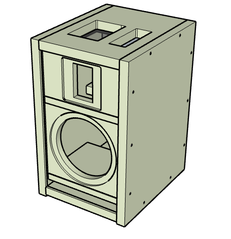
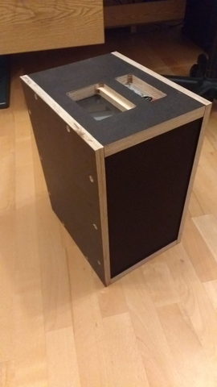

# Apparillo 6
Portabler Lautsprecher auf Basis der Audible 17 mit Raspberry Pi und moOde audio player.
Alternativ zur Audible 17 bieten sich auch andere Lautsprecher an.
https://moodeaudio.org/
https://www.lautsprecherbau.de/magazine/lautsprecherbau-magazin-2014/februar-2014/audible-17-einfach-besser-hoerbar_8636,de,901172,16142

## Features:
- WebUi und MPD
- WiFi Access Point (AP) Mode
- Bluetooth, Airplay, Spotify, UPnP
- Touch LCD-Display mit automatischer Abschaltung
- ca. 15h Akkulaufzeit
- Nach Ausschalten werden alle Verbraucher durch Relais vom Akku getrennt

## Bauteile:
- Audible 17 (Gradient AXP 06, Gradient GAM 100)
- Raspberry Pi 3B+
- Hifiberry AMP+
- Lithium-Polymer Akku (4S 16000mAh)
- 5" LCD Touchscreen (HDMI)
- Relais
- ProtoHat
- Stacking Header
- 2 Taster, Rotary Encoder, Ladebuchse
- Schutzgitter mit Lautsprecherstoff bezogen

## Setup
1. Lautsprecher und Frequenzweiche zusammenbauen (Apparillo6-Pläne.skp). Alternativ bieten sich auch andere Bausätze von Udo Wohlgemuth an.
1. Hifiberry und Raspberry Pi zusammenbauen
1. moOde OS von https://moodeaudio.org/ installieren und einstellen
1. Bauteile auf ProtoHat löten
1. Frequenzweiche, Rotary Encoder, Buttons, HDMI anschließen (SchaltungApparillo6.fzz)
1. Spannungsversorgung des RasPi und des Displays (USB) an die Relais anschließen
1. Ladebuchse an Akku anschließen
1. config.txt auf RasPi ersetzten
1. io-apparillo6.py in home Verzeichnis kopieren
1. io-apparillo6.service als systemd Service einrichten
1. gpiozero installieren
1. Msuik auf RasPi kopieren
1. Alles fixieren und Lautpsrecher schließen
1. Alle Funktionen testen
1. Kleine Spende für stetige Weiterentwicklung und umfangreichen Support an Tim Curtis von moOde Audio schicken https://moodeaudio.org/

## ToDo
- Einfachere/Automatisierte Installation
- Messung und Darstellung des Akkuladezustands
- Stereo Variante oder modulares System
- Zusätzlicher analoger Input

